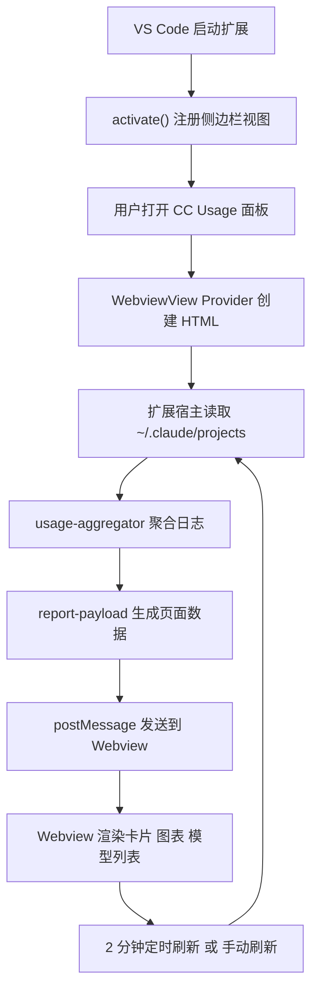

# CC Usage VS Code Plugin 技术设计文档

## 1. 文档信息

- 文档名称：CC Usage VS Code 插件技术设计文档
- 文档版本：v0.1
- 文档日期：2026-04-28
- 关联文档：`docs/prd-vscode-plugin.md`
- 当前状态：草案

## 2. 设计目标

本文档用于说明如何把当前 `cc-usage` 本地网页工具升级为一个可在 VS Code 中运行的侧边栏插件。

这份设计文档重点解决以下问题：

1. 插件代码整体怎么分层。
2. 目录结构应该怎么调整。
3. VS Code 扩展如何被激活。
4. 侧边栏面板如何注册和渲染。
5. Webview 页面如何和扩展宿主通信。
6. 现有聚合逻辑和现有页面代码哪些可以复用，哪些需要改。
7. 首版如何开发、调试、验证。

本文档不进入逐行实现步骤，也不直接给出最终代码。它的目标是把首版技术方案收敛到一个清晰、稳定、可执行的形态。

## 3. 当前项目现状

当前仓库本质上是一个“本地数据聚合器 + 本地 HTTP 服务 + 浏览器页面”的结构。

### 3.1 当前模块边界

- `src/usage-aggregator.js`
  - 负责递归扫描 `.jsonl` 文件
  - 负责解析 Claude Code 日志记录
  - 负责按日期、按模型聚合 token 数据

- `src/report-payload.js`
  - 负责把聚合结果封装成前端页面直接可消费的 payload
  - 负责预计算 `all`、`days30`、`days7` 三种窗口数据

- `src/live-report-server.js`
  - 负责本地 HTTP 服务
  - 提供 `/api/report` 和 `/` 两个入口

- `public/index.html`
  - 负责展示指标卡片、图表和模型分布
  - 当前通过 `fetch('/api/report')` 拉取数据

- `server.js`
  - 负责启动本地服务

### 3.2 当前项目的可复用价值

当前项目最值得保留的部分不是 HTTP 服务，而是两块能力：

1. 聚合逻辑已经从页面和服务中分离出来。
2. 页面已经有一套可工作的可视化结构。

这说明首版迁移不应重写业务核心，而应替换宿主环境：

- 旧宿主：Node HTTP 服务 + 浏览器
- 新宿主：VS Code 扩展宿主 + WebviewView

## 4. 方案选型

### 4.1 备选方案

#### 方案 A：保留聚合逻辑，改造成 VS Code WebviewView 侧边栏插件

思路：

- 保留 `usage-aggregator` 和 `report-payload`
- 去掉页面对 `/api/report` 的依赖
- 改由 VS Code 扩展宿主直接调用聚合逻辑
- 再通过 Webview 消息通信把数据发给页面

优点：

- 复用率最高
- 改造成本最低
- 最接近当前仓库结构
- 最适合首版快速落地

缺点：

- 页面脚本需要改写为 Webview 通信模型
- 后续跨 IDE 还需要再做一层宿主适配

#### 方案 B：完全重写为原生 Tree View 风格插件

思路：

- 不复用当前 `public/index.html`
- 用 VS Code 原生视图树来展示统计数据

优点：

- 更原生
- 宿主集成感更强

缺点：

- 当前图表和卡片布局表达能力会明显下降
- 首版需要牺牲大量现有 UI 价值
- 对当前项目不划算

#### 方案 C：先抽核心库，再分别做网页版和插件版壳

思路：

- 先重构项目结构
- 再分别适配浏览器版和 VS Code 版

优点：

- 长期结构最规范
- 后面扩平台更顺

缺点：

- 首版学习成本高
- 需要先做较重的工程化调整
- 对“先做出一个能用插件”这个目标不够友好

### 4.2 选型结论

首版采用 `方案 A`。

原因很明确：

1. 它最大化复用你现有仓库。
2. 它可以把学习重点集中在 VS Code 插件最核心的几个概念上。
3. 它不要求首版就做复杂架构重构。
4. 它最适合你当前“先自己用、先跑通开发测试”的目标。

## 5. 首版总体架构

首版插件采用三层结构：

1. 核心层：本地日志读取与聚合
2. 扩展层：VS Code 激活、视图注册、刷新调度、消息通信
3. 展示层：Webview HTML/CSS/JS

### 5.1 架构说明

- 核心层继续保留当前 Node 运行方式，直接运行在 VS Code Extension Host 中。
- 扩展层负责充当“页面和本地文件系统之间的桥”。
- 展示层不再主动请求 `/api/report`，而是被动接收宿主推送的数据。

### 5.2 架构图



## 6. 推荐目录结构

### 6.1 目标目录结构

```text
.
├─ docs/
│  ├─ prd-vscode-plugin.md
│  ├─ technical-design-vscode-plugin.md
│  └─ implementation-plan-vscode-plugin.md
├─ media/
│  ├─ view.css
│  └─ view.js
├─ public/
│  └─ index.html
├─ src/
│  ├─ extension.js
│  ├─ webview/
│  │  ├─ usage-view-provider.js
│  │  └─ webview-template.js
│  ├─ core/
│  │  ├─ usage-aggregator.js
│  │  ├─ report-payload.js
│  │  └─ path-utils.js
│  └─ legacy/
│     └─ live-report-server.js
├─ tests/
│  ├─ fixtures/
│  ├─ usage-aggregator.test.js
│  ├─ report-payload.test.js
│  └─ extension-smoke.test.js
├─ package.json
├─ server.js
└─ .vscode/
   ├─ launch.json
   └─ tasks.json
```

### 6.2 结构调整原则

#### 原则 1：保留核心逻辑，但把它从“网页工具附属代码”变成“插件可复用核心”

当前 `usage-aggregator.js` 和 `report-payload.js` 应转入 `src/core/`。这样后面不管你保不保留浏览器版，这两部分都不再和具体宿主耦合。

#### 原则 2：把 VS Code 扩展专属代码独立出来

`extension.js`、`usage-view-provider.js`、`webview-template.js` 都属于插件宿主层，不应和核心聚合代码混在一起。

#### 原则 3：把 Webview 静态资源和老的 public 页面区分开

首版可以复用现有页面结构，但建议把最终插件要加载的 JS/CSS 放到 `media/` 下。因为这更符合 VS Code 扩展的常见组织方式，也更容易控制资源 URI。

#### 原则 4：保留旧服务模式，但降级为兼容或开发辅助能力

`server.js` 和 `live-report-server.js` 首版不必立刻删除。它们可以保留，作为：

- 对照验证当前插件结果是否一致的基准
- 兼容已有工具使用方式
- 迁移期间的回退路径

## 7. 关键模块设计

## 7.1 核心层

### 7.1.1 `src/core/usage-aggregator.js`

职责：

- 递归扫描日志目录
- 解析 `.jsonl` 内容
- 聚合日维度和模型维度用量

首版是否需要改逻辑：

- 核心算法不需要大改
- 主要是迁移路径
- 可以补少量错误包装和更明确的异常信息

为什么保留：

- 这是当前项目最有价值的业务核心
- 现有测试已经覆盖关键路径

### 7.1.2 `src/core/report-payload.js`

职责：

- 把聚合结果变成页面和 Webview 都可直接消费的统一数据结构

首版是否需要改逻辑：

- 逻辑基本可保留
- 可以补充更明确的状态字段，例如 `hasData`、`errorMessage`，但不是必须

### 7.1.3 `src/core/path-utils.js`

新增职责：

- 专门处理默认日志路径解析
- 统一处理 `~/.claude/projects`
- 减少路径逻辑散落在多个文件中的情况

为什么要新增：

- 现在 `resolveHomePath` 在 `live-report-server.js` 里
- 插件版也需要路径解析能力
- 这块属于宿主无关逻辑，应独立出来

## 7.2 扩展层

### 7.2.1 `src/extension.js`

职责：

- 作为 VS Code 扩展入口
- 导出 `activate(context)` 和 `deactivate()`
- 注册侧边栏 View Provider
- 注册刷新命令

首版只做这些事情，不在这里堆业务逻辑。

### 7.2.2 `src/webview/usage-view-provider.js`

职责：

- 实现 `WebviewViewProvider`
- 在面板第一次显示时创建 HTML
- 监听 Webview 发来的消息
- 调用核心聚合逻辑
- 把聚合结果回传给 Webview
- 管理自动刷新定时器

这是首版最核心的插件宿主模块。

### 7.2.3 `src/webview/webview-template.js`

职责：

- 生成 Webview 最终使用的 HTML
- 注入 VS Code 资源 URI
- 注入 CSP
- 关联 `media/view.css` 和 `media/view.js`

为什么不直接把整段 HTML 写进 `extension.js`：

- 可维护性太差
- 不利于后续调整样式和脚本

## 7.3 展示层

### 7.3.1 `media/view.js`

职责：

- 接收宿主发送的 payload
- 完成页面渲染
- 处理时间窗口切换
- 处理刷新按钮点击
- 通过 `vscode.postMessage()` 向宿主发消息

和当前 `public/index.html` 相比，最大的变化是：

- 不再 `fetch('/api/report')`
- 改为使用 `window.addEventListener('message', ...)`
- 改为通过 VS Code API 请求刷新

### 7.3.2 `media/view.css`

职责：

- 承载页面样式
- 做侧边栏窄宽度适配
- 尽量贴近 VS Code 色彩变量

为什么拆出来：

- 现在 `public/index.html` 是单文件，适合原型，不适合插件长期维护

## 8. 插件入口设计

### 8.1 推荐入口形态

首版推荐使用 `Activity Bar 自定义 View Container + 单个 WebviewView`。

也就是说：

- 左侧 Activity Bar 上有一个单独图标
- 点击图标后，侧边栏显示 `CC Usage` 面板

### 8.2 为什么不用 Explorer 子视图

Explorer 子视图也能做，但它有两个问题：

1. 入口弱，用户容易忽略。
2. 这个工具是一个完整功能面板，不是资源树的附属项。

对首版来说，独立入口更清晰，也更符合“一个插件就是一个看板能力”的认知。

### 8.3 `package.json` 中需要声明的能力

首版插件至少需要声明这些内容：

- `main`
- `engines.vscode`
- `activationEvents`
- `contributes.viewsContainers`
- `contributes.views`
- `contributes.commands`

说明：

- `viewsContainers` 用来在 Activity Bar 放一个独立入口
- `views` 用来注册面板视图
- `commands` 至少注册一个手动刷新命令

## 9. 激活流程设计

### 9.1 激活时机

推荐使用“按视图激活”，不要在 VS Code 启动时就无条件执行所有逻辑。

推荐激活点：

- 用户打开 `CC Usage` 视图时激活
- 用户触发刷新命令时激活

### 9.2 激活流程

1. VS Code 加载扩展清单。
2. 用户点击 Activity Bar 中的 `CC Usage` 图标。
3. VS Code 触发扩展激活。
4. `activate(context)` 注册 `UsageViewProvider`。
5. Provider 在 `resolveWebviewView()` 中创建 Webview。
6. Provider 生成 HTML 并绑定消息监听。
7. Provider 立即发起首次数据加载。
8. Provider 启动 2 分钟自动刷新定时器。

### 9.3 停用流程

1. 扩展被停用或窗口关闭。
2. 需要释放自动刷新定时器。
3. 销毁对 Webview 的引用。

首版不需要复杂资源回收，但定时器一定要清理。

## 10. Webview 通信设计

## 10.1 为什么不能继续用 `/api/report`

在 VS Code Webview 里继续起一个本地 HTTP 服务理论上可行，但这不是首版最合理的路径。

原因：

1. 它会让插件架构多一层无意义绕路。
2. 你本来就在扩展宿主里，可以直接读文件和调用聚合逻辑。
3. 还会引入端口占用、服务生命周期、异常清理等额外问题。

因此，首版应改为宿主与 Webview 的消息通信模型。

## 10.2 通信模型

### 宿主 -> Webview

宿主通过 `webview.postMessage()` 发送：

- `loading`
- `reportData`
- `error`

### Webview -> 宿主

Webview 通过 `vscode.postMessage()` 发送：

- `ready`
- `refresh`

### 推荐消息结构

```json
{
  "type": "reportData",
  "payload": {
    "generatedAt": "2026-04-28T12:00:00.000Z",
    "sourceDir": "C:\\Users\\Cap\\.claude\\projects",
    "report": {},
    "windows": {}
  }
}
```

```json
{
  "type": "error",
  "message": "未找到日志目录"
}
```

```json
{
  "type": "refresh"
}
```

## 10.3 通信流程

1. Webview HTML 加载完成。
2. Webview 发送 `ready`。
3. Provider 收到 `ready` 后执行首次加载。
4. Provider 发送 `loading`。
5. Provider 调用 `buildReportPayload()`。
6. 成功后发送 `reportData`。
7. 失败后发送 `error`。
8. 用户点击刷新按钮时，Webview 发送 `refresh`。
9. Provider 收到后重新执行同一套加载逻辑。

## 11. 刷新机制设计

### 11.1 首次加载

在面板初始化完成后立即加载一次数据。

### 11.2 自动刷新

使用 `setInterval()` 在扩展宿主侧每 120000 毫秒触发一次刷新。

这样做的原因：

- 聚合逻辑在宿主侧
- 文件系统读取也在宿主侧
- 由宿主统一调度更清晰

### 11.3 手动刷新

支持两种触发方式：

1. 面板内点击刷新按钮
2. VS Code 命令面板执行 `CC Usage: Refresh`

这两条路径都应进入同一个 `refresh()` 方法。

### 11.4 防重入设计

如果用户频繁点击刷新，或者自动刷新和手动刷新撞上，应该避免并发重复扫描。

首版建议：

- Provider 内部维护一个 `isRefreshing` 标记
- 如果当前正在刷新，则忽略重复请求

这是足够简单且足够实用的首版方案。

## 12. 页面迁移设计

## 12.1 复用策略

首版不重做 UI，而是迁移现有页面结构。

可直接复用的内容：

- 指标卡片布局
- 时间窗口切换逻辑
- 图表渲染逻辑
- 模型列表渲染逻辑
- 空状态展示逻辑

必须修改的内容：

1. `fetch('/api/report')` 改为监听宿主消息
2. 刷新按钮改为向宿主发 `refresh`
3. 内联 CSS/JS 拆到 `media/`
4. 顶部路径文案不要写死 `C:\Users\Cap\.claude\projects`
5. 样式要兼容 VS Code 深浅色主题和窄侧栏

## 12.2 首版 UI 适配重点

### 宽度适配

浏览器版页面宽度较大，VS Code 侧边栏通常更窄。首版需要重点优化：

- 标题字号
- 卡片尺寸
- 图表最小 bar 宽度
- 模型列表换行策略

### 主题适配

首版建议逐步用 VS Code CSS 变量替换硬编码颜色，例如：

- `var(--vscode-editor-foreground)`
- `var(--vscode-editor-background)`
- `var(--vscode-button-background)`

这样可以减少深色主题下的违和感。

## 13. 错误处理设计

### 13.1 需要覆盖的错误场景

1. 默认日志目录不存在
2. 目录无法读取
3. 目录为空
4. 文件内容损坏或部分 JSON 解析失败
5. 聚合后无有效记录
6. Webview 尚未准备好时收到刷新请求

### 13.2 错误处理原则

1. 尽量在宿主层捕获并转成可读消息
2. Webview 只负责展示，不在前端拼装复杂错误判断
3. 局部坏数据不应导致整个文件扫描失败，除非是致命读取错误

### 13.3 推荐错误文案方向

- `未找到 Claude Code 日志目录`
- `无法读取日志目录`
- `没有找到可聚合的用量记录`
- `刷新失败，请稍后重试`

## 14. 开发与调试设计

## 14.1 首版开发方式

采用标准 VS Code 扩展开发模式：

1. 在当前仓库补齐扩展清单和入口文件
2. 用 `F5` 启动 Extension Development Host
3. 在新开的 VS Code 开发宿主窗口里测试插件

### 14.2 新手需要理解的几个概念

#### 扩展宿主

你的插件代码不是跑在当前 VS Code 主窗口页面里，而是跑在一个扩展宿主环境里。

#### Webview

Webview 本质上是插件里的一个嵌入网页。它能画 UI，但不能直接像 Node 那样随便访问本地文件系统，所以文件读取和聚合逻辑应放在扩展宿主侧。

#### 开发宿主窗口

按 `F5` 运行扩展后，VS Code 会打开一个新的测试窗口。你应该在那个新窗口里看插件效果。

## 14.3 调试重点

首版调试需要重点关注：

1. 扩展是否被正确激活
2. 侧边栏入口是否出现
3. Webview 是否成功渲染
4. 首次加载是否成功
5. 自动刷新是否按 2 分钟执行
6. 手动刷新是否生效
7. 数据结果是否与当前网页版一致

## 15. 测试设计

### 15.1 测试策略

首版测试分三层：

1. 核心逻辑测试
2. Payload 组装测试
3. 插件级最小冒烟测试

### 15.2 核心逻辑测试

继续保留并扩展现有 `usage-aggregator` 测试，确保迁移目录后行为不变。

### 15.3 Payload 测试

建议增加 `report-payload` 测试，覆盖：

- `all`、`30d`、`7d` 窗口结果
- `generatedAt` 和 `sourceDir`
- 空目录或无结果场景

### 15.4 插件冒烟测试

首版不追求复杂 UI 自动化，但至少要保证：

- 扩展可以激活
- Provider 可以注册
- 关键命令可以创建

### 15.5 人工验证清单

1. 打开开发宿主窗口后能看到 `CC Usage` 图标
2. 点击后能看到面板
3. 面板能显示真实数据
4. 点击刷新按钮数据能更新
5. 2 分钟后自动刷新仍然正常
6. 临时把默认目录改错时，能看到错误提示

## 16. 是否保留旧网页模式

### 16.1 结论

首版建议保留。

### 16.2 原因

1. 旧模式可以作为插件版结果对照基线
2. 迁移中出现问题时容易回退
3. 它本身也还是一个可用工具

### 16.3 定位调整

从产品角度看，网页模式不再是主路径。

从工程角度看，它仍然是：

- 回归测试基准
- 调试辅助工具
- 兼容保留能力

## 17. 实施顺序建议

按首版复杂度，建议分五个阶段推进：

### 阶段 1：扩展脚手架落地

- 把仓库变成可被 VS Code 识别的扩展项目
- 注册侧边栏入口
- 跑通空面板

### 阶段 2：核心逻辑迁移

- 重组目录
- 保证聚合逻辑可从扩展入口调用
- 补齐路径工具

### 阶段 3：Webview UI 迁移

- 从现有页面拆出 CSS/JS
- 接上宿主消息通信
- 跑通渲染

### 阶段 4：刷新和错误处理

- 做首次加载
- 做手动刷新
- 做 2 分钟自动刷新
- 做错误显示和防重入

### 阶段 5：验证与收尾

- 做数据一致性对照
- 跑测试
- 补 README 中的插件开发说明

## 18. 本文档中的最终技术决策

本文档对首版实现作出以下明确技术决策：

1. 首版采用 VS Code `WebviewView` 侧边栏实现，不采用 Tree View。
2. 首版采用 Activity Bar 独立入口，不挂到 Explorer 子视图。
3. 首版不再通过本地 HTTP API 向页面供数，改为宿主与 Webview 消息通信。
4. 首版保留现有聚合逻辑，不重写业务核心。
5. 首版保留旧网页模式，但降级为兼容和调试用途。
6. 首版自动刷新在扩展宿主侧实现，周期固定为 2 分钟。
7. 首版不做路径配置，默认读取 `~/.claude/projects`。

## 19. 下一步

技术设计确认后，下一步进入实现计划拆解。实现计划需要把本设计文档拆成按阶段、按文件、按测试路径组织的可执行任务清单，然后才能开始编码。
